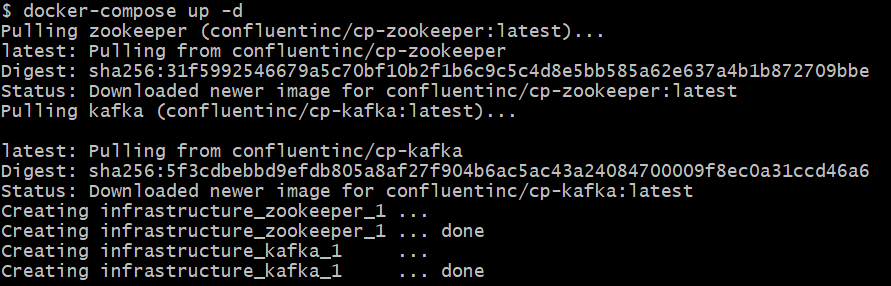
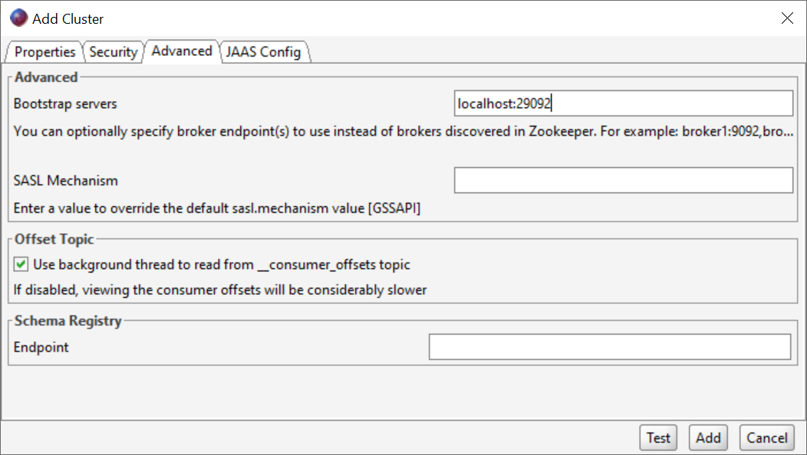
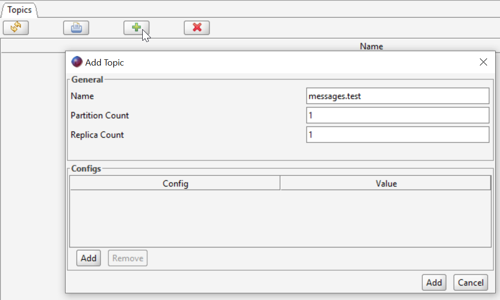

# ¿How to Run this project?

## 1- Install Docker Desktop
If you don't have Docker intalled on your computer go to [Docker](https://www.docker.com/products/docker-desktop/) and follow the instructions.

## 2- Start Kafka Server
You need to run docker-compose command to start the Kafka Server, for this go to the infrastructure folder and run **docker-compose up -d** command

## 3- Connection Using Kafka Tool
Use [Kafka Tool](https://kafkatool.com/download.html) GUI utility to establish a connection with your Kafka Server.
Once you have installed Kafka Tool, open it up and go to **File --> Add New Connection** on the Properties tab you should set the Cluster Name and on the Advanced tab you should set the Bootstrap server's value on this field, you can set it as **localhost:29092** because on our **docker-compose.yml** we configure it as **29092** as the port to expose our Kafka server. Finally press on **Add** to create the connection.

## 4- Create Test Topic
Once you have connected to the Kafka server you need to create a topic to store the messages. Go to your connection and select the topics folder, then press on the Add button and fill the required parameters. Finally press on **Add** to create the topic.

## How to add and read messages from the topic?

* ### Add messages
  To add messages to the topic you need to run **Kafka.Producer.API** project, this project is an API that generate messages on the topic, which you have created previously.
* ### Read messages
  To read messages from the topic you need to run **Kafka.Consumer.Service** project, this project run as a background service that executes a task every 10 seconds, the messages read are printed on the console.

## Important
If you set a different name to **messages.topic** the topic name, then you need to change the **TopicName** value on the **appsettings.json** file for the two projects.

